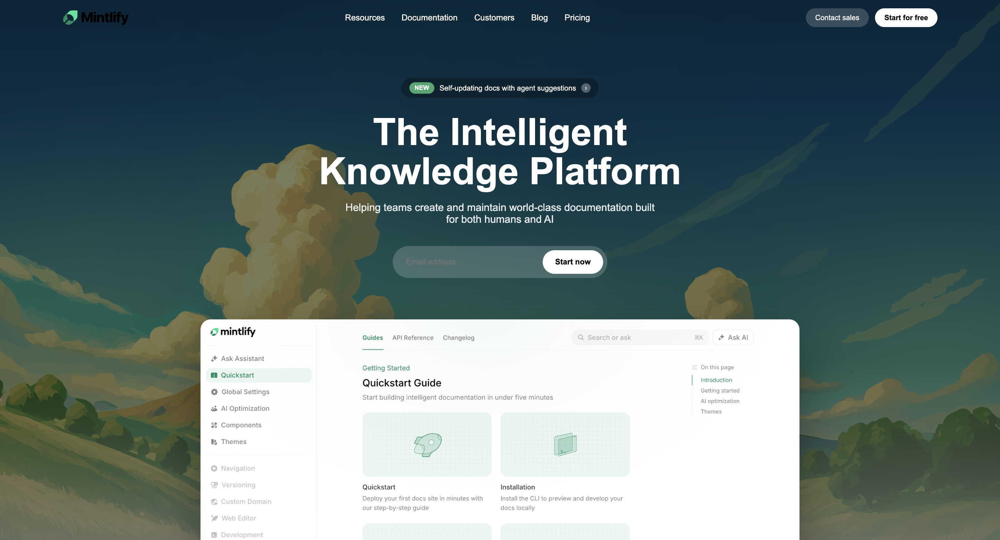
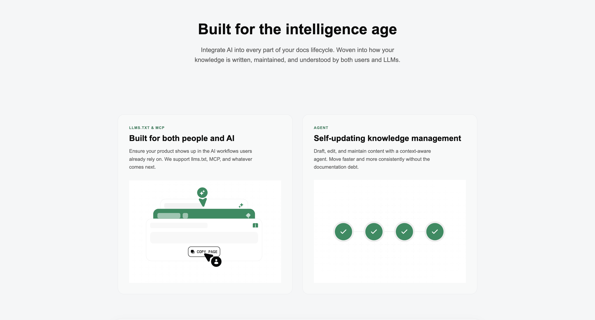
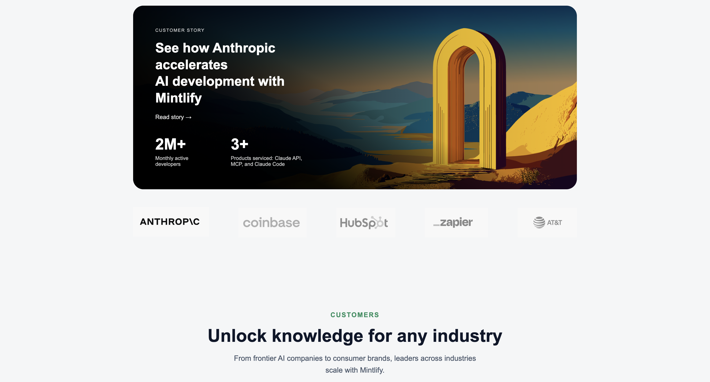
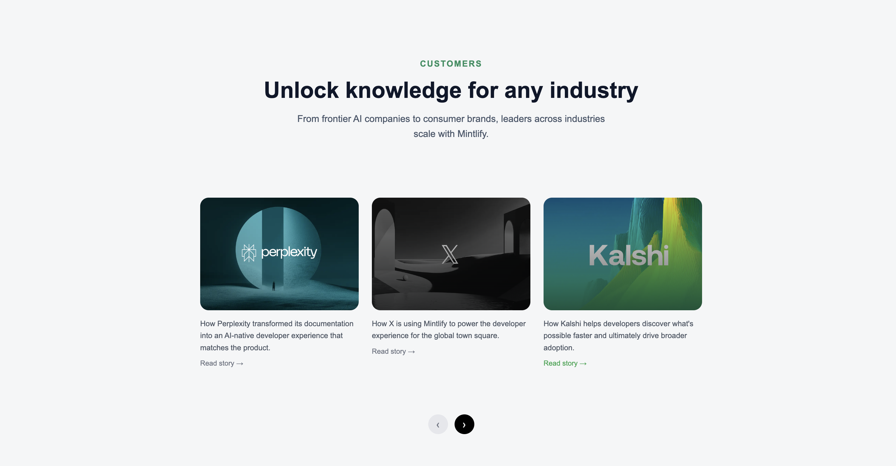
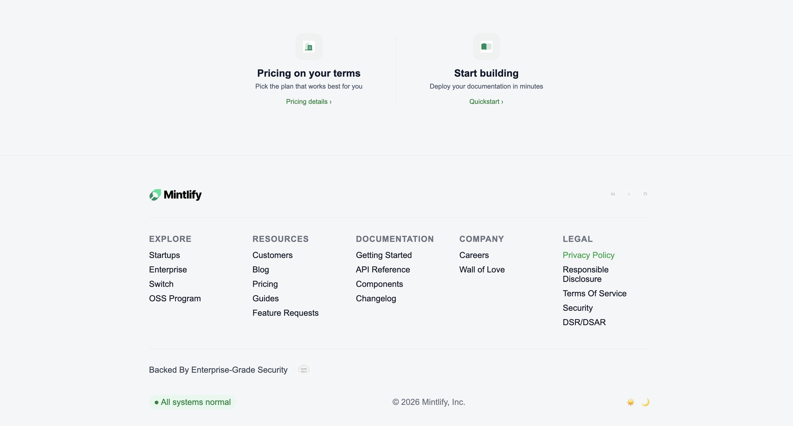

# Mintlify Landing Page Clone

A **pixel-inspired frontend clone** of the Mintlify landing page built using **pure HTML and CSS**.

This project focuses on:

* Clean layout structure
* Modern SaaS UI design
* Proper spacing, typography, and alignment
* Real-world landing page sectioning

---

## 🚀 Features

* Hero section with background image & CTA
* Trusted-by company logos strip
* AI feature cards & enterprise sections
* Customer stories cards layout
* Final call-to-action section
* Fully structured production-style footer

---

## 🛠 Tech Stack

* **HTML5**
* **CSS3 (Flexbox + Grid)**
* No frameworks used (pure frontend fundamentals)

---

## 📂 Folder Structure

```
project/
│
├── index.html
├── style.css
│
├── images/
│   ├── hero.png
│   ├── anthropic.png
│   ├── perplexity.png
│   ├── x.png
│   ├── kalshi.png
│   ├── mintlify.png
│   └── ...
│
└── screenshot/
    ├── preview.png
    ├── preview1.png
    ├── preview2.png
    ├── preview3.png
    └── preview4.png
```

---

## 📸 Preview Screenshots (with paths)

### 1️⃣ Hero Section

Path → `screenshot/preview.png`



---

### 2️⃣ Features Section

Path → `screenshot/preview1.png`



---

### 3️⃣ Customer Stories Section

Path → `screenshot/preview2.png`



---

### 4️⃣ Call-to-Action Section

Path → `screenshot/preview3.png`



---

### 5️⃣ Footer Section

Path → `screenshot/preview4.png`



---

## ▶️ How to Run

1. Download or clone the repository
2. Open the project folder
3. Double-click **index.html**

No build tools required.

---

## 🎯 Learning Outcome

This project helped practice:

* Real SaaS landing page layout thinking
* Clean CSS structuring
* Component-style section building
* Production-level spacing and typography

---

## 📌 Future Improvements

* Make the page **fully responsive (mobile + tablet)**
* Add **hover animations & transitions**
* Convert into a **React component-based project**

---

## 👨‍💻 Author

**Gunjan Basak**
B.Tech IT Student | Frontend & MERN Learner
